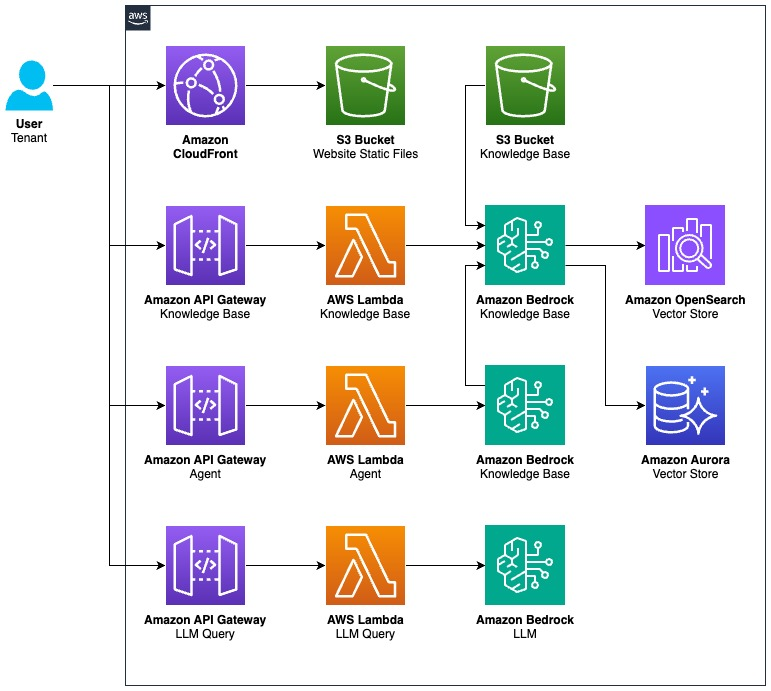
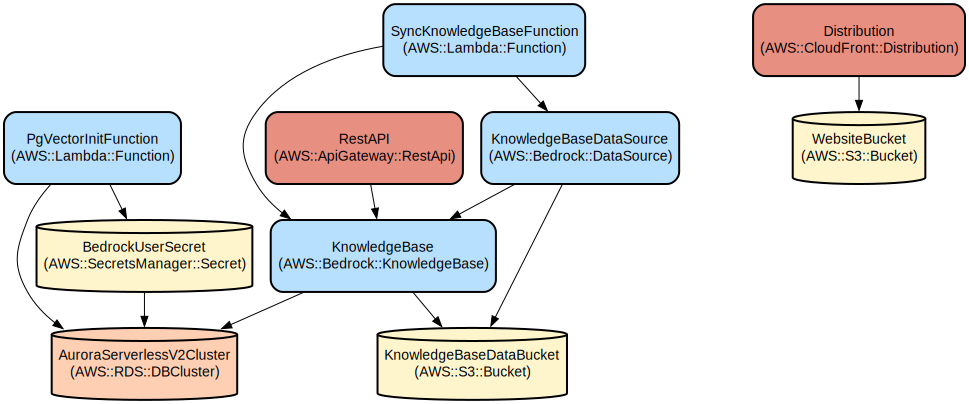

# Bedrock Knowledge Base Chat Application with Guardrails

A secure and scalable chat application that leverages AWS Bedrock for knowledge base interactions with configurable guardrails, supporting both OpenSearch and Aurora PostgreSQL vector storage options.

This project implements a web-based chat interface that connects to AWS Bedrock for intelligent responses, with built-in guardrails for content safety and data protection. The application provides vector-based knowledge retrieval using either Amazon OpenSearch Serverless or Aurora PostgreSQL, allowing organizations to maintain control over sensitive information while leveraging the power of large language models.

## Repository Structure
```
.
├── infrastructure/           # AWS CDK infrastructure code
│   ├── bin/                 # CDK app entry point
│   ├── lambda/              # Lambda function implementations
│   │   ├── common_utils.py  # Shared utilities for Lambda functions
│   │   └── layers/         # Lambda layer dependencies
│   └── lib/                # CDK stack constructs
├── website/                # React-based frontend application
│   ├── src/               # Source code for the web interface
│   │   ├── components/    # React components
│   │   ├── styles/       # CSS styling
│   │   └── utils/        # Frontend utilities
└── package.json           # Root package configuration for monorepo
```

## Usage Instructions
### Prerequisites
- Node.js 18.x or later
- AWS CLI configured with appropriate credentials
- AWS CDK CLI installed globally (`npm install -g aws-cdk`)
- Python 3.12 for Lambda functions
- Docker for building Lambda layers
- An AWS account with Bedrock access enabled

### Installation

1. Clone the repository and install dependencies:
```bash
# Install all workspace dependencies
npm run install:all
```

2. Build the project:
```bash
# Build both frontend and infrastructure
npm run build
```

3. Deploy the infrastructure:
```bash
# Deploy with OpenSearch (default)
npm run deploy

# Deploy with OpenSearch and local debugging enabled
npm run deploy:local

# Deploy with Aurora PostgreSQL
npm run deploy:aurora

# Deploy with Aurora PostgreSQL and local debugging enabled
npm run deploy:local:aurora
```

The `:local` deployment options configure the Lambda functions with local debugging capabilities, which is useful when you need to troubleshoot issues or monitor detailed execution logs.

### Quick Start

1. After deployment, get the CloudFront URL from the stack outputs:
```bash
aws cloudformation describe-stacks --stack-name sample-gs --query 'Stacks[0].Outputs[?OutputKey==`SampleGS_DistributionDomainName`].OutputValue' --output text
```

2. Access the web interface using the CloudFront URL.

3. Start chatting with the knowledge base by entering queries in the chat interface.

### Local Development

To run the frontend application locally for development:

```bash
# Start the React development server
npm run dev
```

This will launch the website in development mode with hot reloading enabled. The local development server typically runs on http://localhost:3000 (or another port if 3000 is in use).

### More Detailed Examples

1. Using Guardrails:
```javascript
// Example API call with guardrails
const response = await apiClient.invokeAgent({
  query: "Tell me about security policies",
  guardrailId: "your-guardrail-id"
});
```

2. Knowledge Base Queries:
```javascript
// Example knowledge base query
const response = await apiClient.queryKnowledgeBase({
  query: "What are the compliance requirements?",
  sessionId: "optional-session-id"
});
```

### Troubleshooting

1. Infrastructure Deployment Issues:
- Error: "Resource limit exceeded"
  - Check your AWS account limits for services like Lambda and CloudFormation
  - Request limit increases if needed

2. Chat Interface Issues:
- Error: "Failed to invoke agent"
  - Check network connectivity
  - Verify API Gateway endpoint is accessible
  - Review CloudWatch logs for Lambda function errors

3. Knowledge Base Issues:
- Error: "Vector store initialization failed"
  - For OpenSearch: Check security policies and network access
  - For Aurora: Verify database connectivity and pgvector extension installation

## Data Flow
The application follows a request-response pattern where user queries are processed through multiple AWS services for secure and intelligent responses.

```ascii
User Input → API Gateway → Lambda → Bedrock Agent → Knowledge Base (OpenSearch/Aurora) → Response
     ↑                                    ↓
     └────────────── Guardrails ─────────┘
```

Key component interactions:
1. User submits query through web interface
2. API Gateway routes request to appropriate Lambda function
3. Lambda function invokes Bedrock agent with guardrails
4. Agent queries knowledge base using vector search
5. Response is filtered through guardrails
6. Formatted response returned to user interface

## Infrastructure





### Lambda Functions
- QueryKnowledgeBase: Handles vector search queries
- InvokeAgent: Manages Bedrock agent interactions
- ManageGuardrails: Configures and applies content safety rules
- PgVectorInit: Initializes Aurora PostgreSQL with vector capabilities

### Storage
- OpenSearch Serverless Collection (optional)
  - Vector index for similarity search
  - Security policies for access control
- Aurora PostgreSQL Cluster (optional)
  - pgvector extension for vector operations
  - Serverless v2 for cost optimization

## Knowledge Base Management

### Adding Documents to the Knowledge Base

The application includes an automatic document ingestion pipeline that processes files placed in the designated knowledge base folder:

```
infrastructure/knowledgebase/
```

To add documents to your knowledge base:

1. Place your files in the `infrastructure/knowledgebase/` directory
   - Supported formats: PDF, TXT, DOCX, MD, HTML, CSV
   - Files should contain text-based content for optimal processing

2. Deploy or redeploy the application:
   ```bash
   npm run deploy
   # or any of the other deployment commands
   ```

3. During deployment, the system will:
   - Detect new or modified files in the knowledge base folder
   - Process and chunk the documents appropriately
   - Extract embeddings using Bedrock
   - Store vectors in your selected vector database (OpenSearch or Aurora PostgreSQL)

Files added to this directory are automatically synchronized with your knowledge base on each deployment, making it easy to keep your knowledge base up-to-date with the latest information.

For large document collections, consider organizing files into subdirectories within the knowledge base folder for better management. The ingestion process will recursively scan all subdirectories.

### API Gateway
- REST API with CORS support
- Endpoints for agent interaction, knowledge base queries, and guardrail management

### CloudFront
- Distribution for web interface delivery
- HTTPS enforcement
- Custom error responses for SPA routing

## Security

See [CONTRIBUTING](CONTRIBUTING.md#security-issue-notifications) for more information.

## License

This library is licensed under the MIT-0 License. See the LICENSE file.